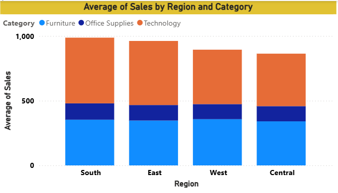
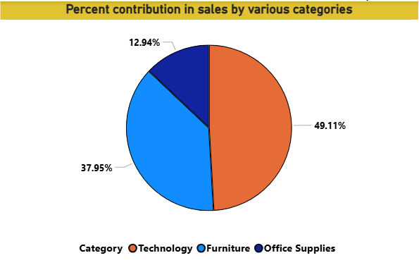

# orders_BI
This project demonstrates basic data visualization using Power BI, including creating interactive dashboards, charts, and reports to analyze data and extract insights.

Developed a Power BI visualization using a stacked column chart to analyze average sales by region and product category. Regions were placed on the X-axis, average sales on the Y-axis, and product categories in the legend, enabling clear comparison of category-wise contribution across different regions and helping identify trends and performance patterns.

orders_BI/Screenshot 2026-03-17 151737.png

Built a Power BI visualization using a pie chart to analyze the percentage of total sales across different product categories. This visual clearly shows how each category contributes to overall sales, helping identify dominant categories and areas with lower contribution for better decision-making.

orders_BI/Screenshot 2026-03-17 152032.png

